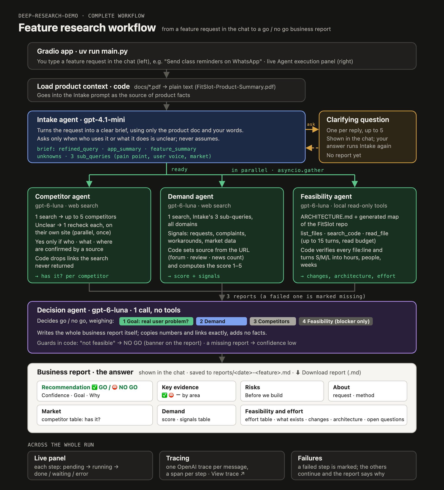

# Deep Research Demo

A feature research assistant for **FitSlot**, a booking and membership platform for small
fitness studios in India. Describe a feature in the chat; a team of AI agents clarifies it,
researches competitors and demand, reviews the FitSlot codebase, and returns a **go / no go
business report** you can download.

Built with **uv**, **Gradio** and the **OpenAI Agents SDK**.



## How it works

| Step | Agent | Model | What it does |
|---|---|---|---|
| 1 | **Intake** | `gpt-4.1-mini` | Turns the request into a clear brief using the product doc in `docs/`. Asks one clarifying question at a time (up to 5), only when who uses the feature or what it does is unclear. Writes 3 search sub-queries for the Demand agent. |
| 2 | **Competitor** | `gpt-6-luna` | One web search finds up to 5 competitors and rates whether each has the feature; competitors left unclear get one more search on their own website. "Yes" only if a source confirms who, what and where. |
| 3 | **Demand** | `gpt-6-luna` | One web search with Intake's 3 sub-queries, across all sites. Collects requests, complaints and workarounds; code labels each signal's source from its URL and scores demand 1–5. |
| 4 | **Feasibility** | `gpt-6-luna` | Reads the FitSlot repo (read-only) using its `ARCHITECTURE.md`, a generated code map and three local tools. Returns what exists, what must change, the architecture and the effort (hours, people, weeks). |
| 5 | **Decision** | `gpt-6-luna` | Decides go / no go, weighing the feature's **goal** first, then demand, competitors and feasibility, and **writes the business report**. |

Steps 2–4 run in parallel once Intake's brief is ready. Code checks the agents' work
throughout: links and file references must be real, scores and effort are computed in code,
and "not feasible" can never be "go".

## The report

The answer in the chat is the Decision agent's report, also saved to
`reports/<date>-<feature>.md` and offered as **⬇ Download report (.md)** under the panel:

- **Recommendation:** ✅ GO / ⛔ NO GO, confidence, goal and why
- **Key evidence**, **Risks**, **Before we build** (or **What would change the answer**)
- **Market:** competitor table (has it? with sources)
- **Demand:** score, queries searched, signals table
- **Feasibility and effort:** effort table, what exists, what must change, architecture, open questions
- **About this assessment:** request, product, unspecified details, method

## Setup

Needs [uv](https://docs.astral.sh/uv/) and an OpenAI API key.

```bash
uv sync
cp .env.example .env      # then set OPENAI_API_KEY and CODEBASE_DIR
uv run main.py            # http://127.0.0.1:7860 (or the next free port)
```

- Put the product description (PDF or text) in `docs/`. The demo uses `FitSlot-Product-Summary.pdf`.
- Point `CODEBASE_DIR` at a local copy of the product's code. An `ARCHITECTURE.md` at its
  root is used as the code map; without it the agent relies on the generated map.

## Configuration (`.env`)

| Variable | Default | Used by |
|---|---|---|
| `OPENAI_API_KEY` | — (required) | all agents |
| `OPENAI_MODEL` | `gpt-4.1-mini` | Intake agent |
| `COMPETITOR_MODEL` | `gpt-6-luna` | Competitor agent |
| `DEMAND_MODEL` | `gpt-6-luna` | Demand agent |
| `FEASIBILITY_MODEL` | `gpt-6-luna` | Feasibility agent |
| `DECISION_MODEL` | `gpt-6-luna` | Decision agent |
| `CODEBASE_DIR` | — (required for Feasibility) | local repo to review, read-only |
| `TEAM_DEVS` / `TEAM_QA` | `1` / `1` | effort estimate |
| `HOURS_PER_DAY` | `5` | focused hours per person per day, for the estimate |
| `DOCS_DIR` | `docs` | product documents for Intake |
| `OPENAI_BASE_URL` | empty | optional OpenAI-compatible endpoint (web search and the code-review domain filter need OpenAI) |
| `OPENAI_AGENTS_DISABLE_TRACING` | `false` | turn off traces in the OpenAI dashboard |
| `GRADIO_SERVER_NAME` / `GRADIO_SERVER_PORT` / `GRADIO_SHARE` | `127.0.0.1` / `7860` / `false` | web server |

## Using the app

- **Chat (left):** type a feature, or pick an example. Answer Intake's question if it asks one.
- **Agent execution (right):** each step shows pending → running → done, waiting or error,
  with its result in a line; then **View trace ↗** and the download button.
- **Clear** (trash icon) starts a new conversation.
- A run takes roughly a minute; the Feasibility and Decision steps are the slowest.

If a research step fails, the others continue and the report says what is missing (with
confidence set to low). If Intake keeps asking, answer in a few words; after 5 questions it
stops and lists the gaps under "details not specified".

## Project layout

```
main.py                    Gradio UI: chat, live execution panel, download button
app/
  config.py                settings from .env
  models.py                model setup shared by all agents, tracing on/off
  documents.py             reads PDFs and text files from docs/
  workflow.py              runs the steps in order, reports progress, saves the report
  intake_agent.py          step 1: clarifying questions → brief + sub-queries
  competitor_agent.py      step 2: competitors and whether they have the feature
  demand_agent.py          step 3: evidence that people want it
  feasibility_agent.py     step 4: code review, architecture and effort
  decision_agent.py        step 5: go / no go and the business report
  execution_graph.py       the Agent execution panel (HTML)
docs/                      product documents (FitSlot-Product-Summary.pdf)
reports/                   saved reports (git-ignored)
workflow.png               complete workflow diagram
*-agent.png                one diagram per agent (.svg sources alongside)
feasibility-agent.md       detailed logic of the Feasibility agent
```

## Run an agent on its own

```bash
uv run python -m app.intake_agent "Add membership pause"
uv run python -m app.competitor_agent "FitSlot: booking software for fitness studios in India" "membership pause"
uv run python -m app.demand_agent "members pause membership from the app" \
  "can't pause gym membership" "freeze plan app review" "gym freeze trend India"
uv run python -m app.feasibility_agent "Send class reminders on WhatsApp"
```

## Tracing

Each chat message is one trace in the [OpenAI dashboard](https://platform.openai.com/traces),
with a span per step (and the agent runs, model calls and tool calls inside). Messages of one
conversation are grouped. The panel's **View trace ↗** opens the run.

## Notes

- The Feasibility agent only reads the codebase. Files in `.git`, `node_modules`, build and
  generated folders, `.env*`, keys and binaries are never loaded or sent.
- Effort uses fixed hours per change size (S 5–10, M 15–25, L 30–50 developer hours, plus QA
  and a buffer): treat it as a range, not a quote.
- Web search results and the model's wording vary between runs, so reports for the same
  feature can differ.
